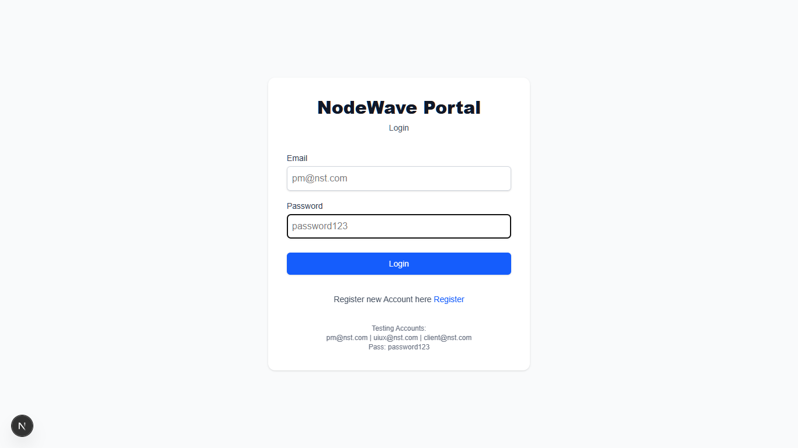
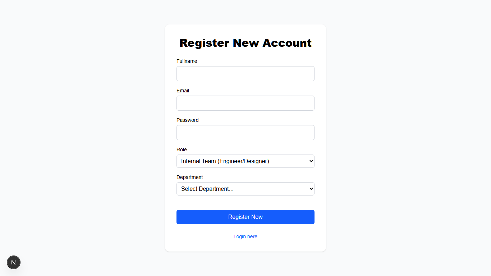
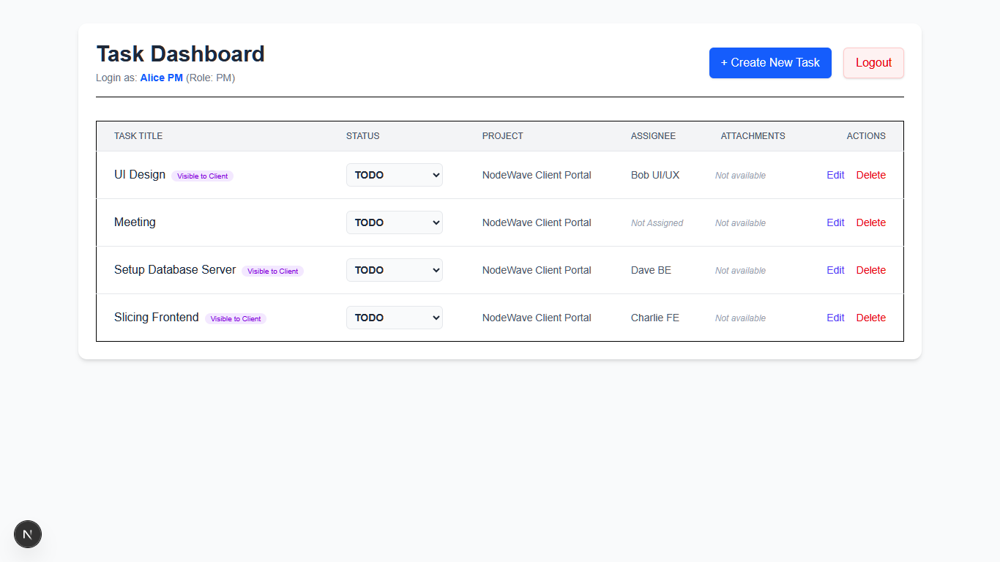
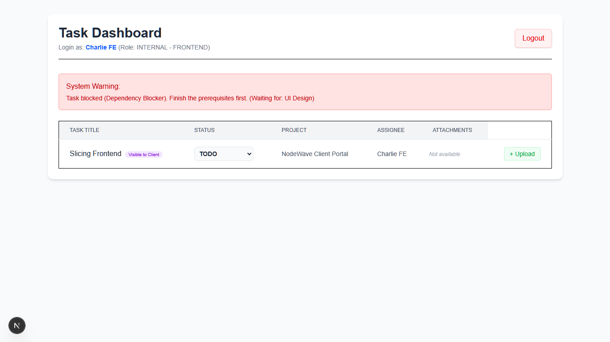
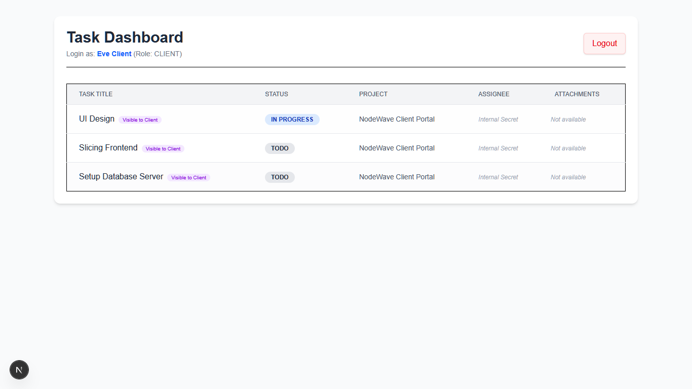
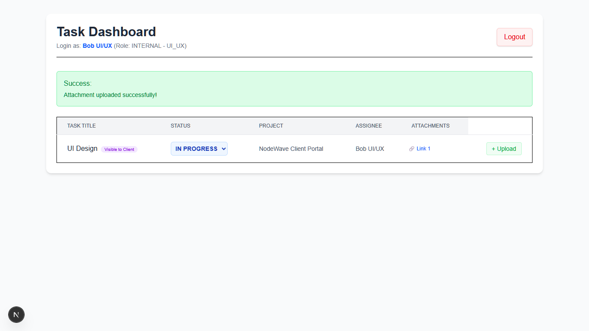

# NodeWave Task Management System

**Author:** Reihan Mursyidi  
**Assessment:** Fullstack Engineer

NodeWave is a role-based task management system for collaborative project workflows. It supports task assignment, dependency-aware status transitions, attachment sharing, optimistic locking, audit logging, and client-safe task visibility.

## Deliverables

### Live Application URLs

- **Frontend:** https://reihan-nst-assessment.vercel.app
- **Backend API:** https://reihan-nst-backend.vercel.app

### Private GitHub Repositories

- **Frontend:** https://github.com/ReihanMursyidi/reihan-nst-frontend
- **Backend:** https://github.com/ReihanMursyidi/reihan-nst-backend

Collaborators `rigenski` and `nodewavescout` have been invited to both repositories.

### Seeded Test Accounts

The following accounts can be used to verify the main application flows:

| Role | Email | Password | Access Level |
| --- | --- | --- | --- |
| **Product Manager (PM)** | `pm@nst.com` | `password123` | Create, edit, assign, and delete tasks |
| **Internal Team (UI/UX)** | `uiux@nst.com` | `password123` | View assigned tasks and upload attachments |
| **Internal Team (Frontend)** | `frontend@nst.com` | `password123` | View assigned tasks and upload attachments |
| **Client Guest** | `client@nst.com` | `password123` | View client-visible tasks only |

## Application Screenshots

### 1. Authentication

**Login**



**Registration**



### 2. Task Board and Dependencies (PM View)



### 3. State-Based Permission: Blocked Task (Internal View)



### 4. Data Isolation and Masking (Client View)



### 5. Attachment Upload (ABAC Implementation)



## Architecture and Core Business Logic

### 1. Role- and Attribute-Based Access Control

The system combines RBAC and ABAC to enforce permissions at both the role and resource levels.

- **RBAC:** The authentication middleware identifies the user from the JWT and resolves the current role from the database. PM-only operations, such as creating tasks, assigning users, and deleting tasks, are restricted at the endpoint level.
- **ABAC:** Resource access is checked against task attributes. Internal users can access and upload attachments only for tasks assigned to their own `userId`. Clients can see only tasks associated with their account and marked with `isClientVisible = true`.

This combination prevents users from gaining access by changing client-side state or guessing resource identifiers.

### 2. Task Dependencies and State Transitions

Tasks are connected through a `TaskDependency` junction table.

Before a task moves to `IN_PROGRESS`, the backend checks whether all prerequisite tasks are complete. If a task depends on unfinished work, the request is rejected with `403 Forbidden` and a `blockedBy` list describing the remaining blockers.

For example, if Task C depends on Tasks A and B, Task C cannot move to `IN_PROGRESS` until both dependencies have reached `DONE`.

### 3. Optimistic Locking

The `Task` table contains a numeric `version` field to prevent lost updates during concurrent modifications.

Each update request includes the version currently held by the client. The backend updates the record only when both the task ID and expected version match:

```ts
where: { id: taskId, version: expectedVersion }
```

A stale version produces `409 Conflict`, allowing the client to refresh the task and retry with current data instead of silently overwriting another user's changes.

### 4. Audit Trail and Soft Deletes

All mutations are recorded in an immutable `AuditLog` table. The audit record includes the acting `userId`, timestamp, and relevant old and new values.

Task mutations and audit-log creation run in the same database transaction. If either operation fails, the transaction is rolled back to keep the task data and audit history consistent.

Deletion is implemented as a soft delete by setting `deletedAt`. Regular queries exclude deleted records while preserving historical data for auditing.

## Technology Stack

- **Backend:** TypeScript, Bun, Hono, Prisma, PostgreSQL (Supabase), Zod, and JWT
- **Frontend:** Next.js 16 App Router, React 19, Zustand 5, Tailwind CSS 4, React Hook Form, and Axios
- **Quality and CI:** Biome, Vitest, Bun tests, and GitHub Actions

## Main User Flows

- PM creates tasks, assigns internal team members, manages dependencies, and updates task visibility.
- Internal team members view their assigned tasks, update progress, and upload work links or attachments.
- Clients view only tasks explicitly marked as visible to clients.
- Concurrent edits are detected through optimistic locking and returned as conflicts instead of overwriting newer data.
